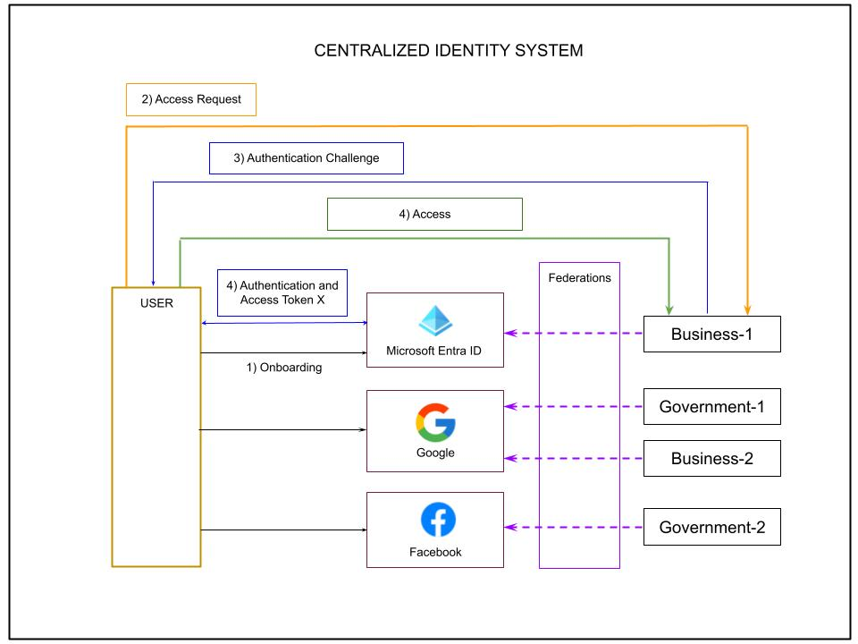
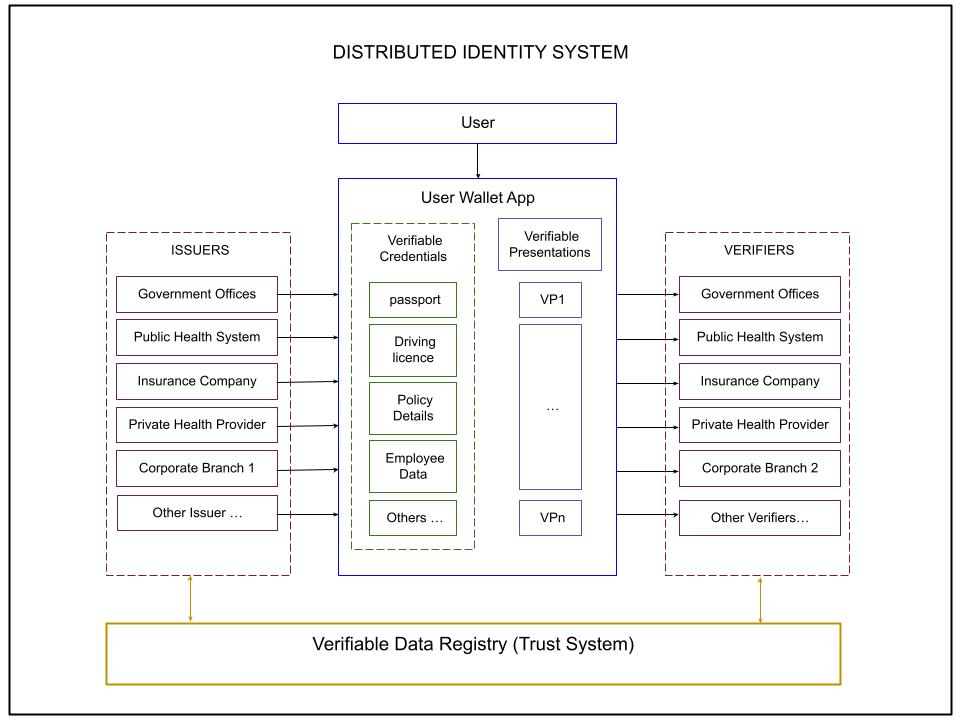

# Verifiable Credentials and Decentralized Identity Systems

   

   

This article is about:

##  The Present Idenity Model  

- The present dominant model of Identity Systems Architecture based on Centralized Identity Systems
- The central role played by Identity Providers in this Centralized Identity Systems (CIS) model
- The problem of loss of ownership and control of the user over their data when it is stored in and shared through a CIS
- The problem of the multiple Federations that is required to established between the organizations that use thi model and the various Identity Providers 
- The problem that each Identity Provider constitutes with its underlaying infrastructure a sigle point of failure of this model and can cause wide access denials

##  The Improved Idenity Model  

- The motivations behind an identity model based on the Dentralized Identity Systems architecture
- The central role played by the user and their wallet application in a Dentralized Identity Systems
- The important fact that the user retains ownership of their verifiable credentials as these are safely stored in their wallet applications on the mobile devices they own and can be unlocled only following gestures, pins or using biometrics

##  A comparative assesment and real-world examples as use cases

The images when taken together help to explain the reasons and the need to consider an Identity model 
based upon the Dentralized Identity System architecture and why it could be preferable to the current 
standard based on Centralized Identity Systems.

The Dentralized Identity System is closer to the real-world case in which a source of authority such as
a Government body, after the required verifications based on physical personal documents and actual human
interaction, issues an official document to a user. The document can later be used by the user to prove 
to other private or public parties some claims about the user, that the source of authority has made and
or verified and established about the user.

The tipical example is that of a driving license, that officially attestS that the holder of the license
document is they who they claim they say they are and that they have successfully attained a legitimate 
right to drive a vehicle following the completion of the prescribed training, and that all this information 
has been verified as facts backed up by the competent authority.

The same principle can be then replicated in a completely digital form whereby the document, in this specific
case a driving license, is no longer issued on paper, instead it is issued in digital form to the user. 
The digital information is also digitally signed by the issuer and unequivocally states that the issuer can 
only be that specific authority by means of the unique cryptographic assets owned by the issuer and employted 
to produce the digital signature. The digital document can finally be safely stored on the personal wallet app 
of the user this document belongs to and further digitally signed by a certificate owned by the user to attest 
that the document does indeed belog to them.

###  Some use-cases 

Consumers of this information stored on the user's device wallet app are other private and public organizations, 
including other government offices. 

An example of a private organization that may make use of a digital driving license could be a car rental business. 
The user could present to the car rental business onboarding process their driving license, confirming to them they 
are legally able to drive a class of vehicles and at the same time providing the relevant information about their identity.

Another example of a private organization that may make use of verifiable credentials issued by a government office
would be a private health provider during the onboarding process of a new patient; in this case the health card and 
some of the public health records of the user may be presented to the private clinic during the onboarding process 
through the user's digital wallet.

As an example of a public office that may be a consumer of the verifiable credentials stored on a user device
wallet application we could think of an office that issues a resident's permit to a parking space or a 
local fihing license, etc.  

The verification process usually consist in the Verifier producing a QR code that the user can use within their 
wallet application through their camera; by scanning the QR code, the creation of a Verifiable Presentaion is triggered.
The Verifiable Presentaion contains the necessary claims about the user together with corrisponding data about the 
issuer of those claim.

The Verifaiable Presentation as a digital asset can then be used by the Verifier. 
The Distributed Trust System (Verifiable Data Register) will be queried by the Verifier using some of the information
embedded in the Verifiable Presentation. In particular, the Verifier will be able to retrive the public keys of the 
issuers for that presentation and verify the its autheticity and also the ownership.
