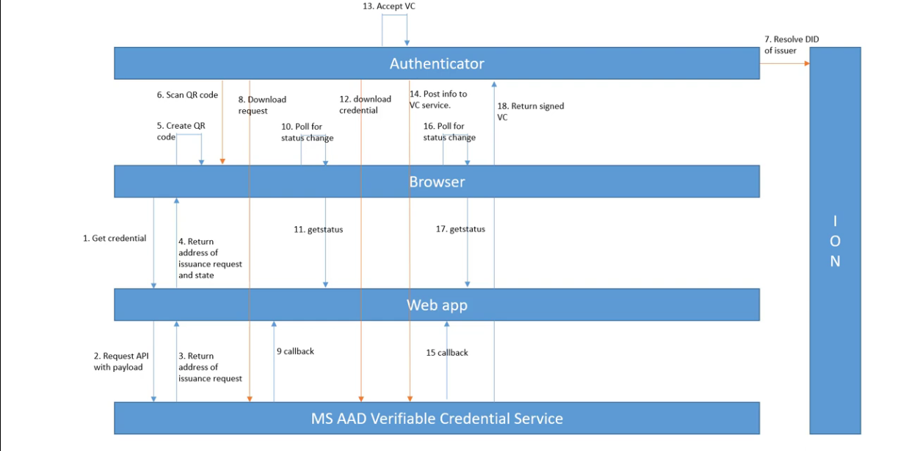
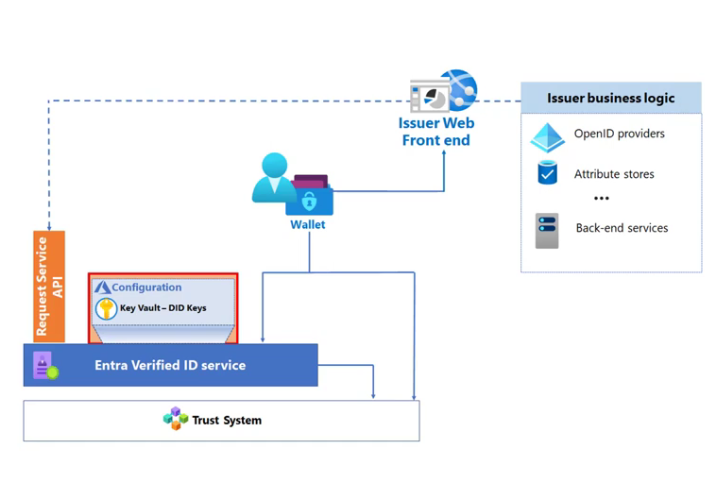
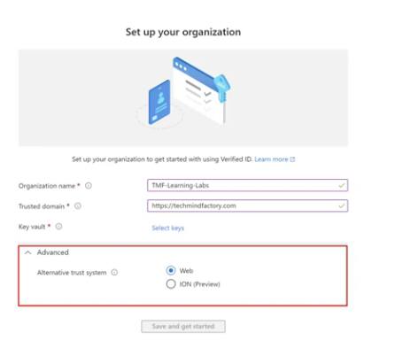

# Decentralized Identity Systems: Under the Hood

*This is the second part of a two-part series. Part one, [Decentralized Identity Systems Concepts](https://www.neteye-blog.com/blog/2026/06/19/decentralized-identity-systems-concepts/), introduced the why and the what. This article explains the how.*

---

Part one established the core idea: instead of a central identity provider sitting in the middle of every trust relationship, users hold digitally signed credentials in a wallet, issuers sign those credentials, and verifiers check them — without needing to call the issuer every time.

This article builds on that foundation and explains the technical mechanisms that make it work. It covers decentralized identifiers, DID documents, trust systems, open standards, the issuance and verification flows, and how Microsoft Entra Verified ID implements all of this in practice. It also covers Face Check and the integration with Entra ID Governance Access Packages.

---

## Decentralized Identifiers

Every participant in a decentralized identity ecosystem — a person, an organization, a device — can be represented by a **Decentralized Identifier**, or DID.

A DID is a portable, globally unique URI that follows a three-part structure defined by the [W3C DID specification](https://www.w3.org/TR/did-core/):

```
did:method:specific-identifier
```

For example:

```
did:web:contoso.com
did:ion:EiAbc123...
```

The three parts are:

- **Scheme** — always `did`
- **Method** — defines how the DID is created, resolved, updated, and deactivated (for example, `web` or `ion`)
- **Method-specific identifier** — a unique string generated according to the rules of the method

DIDs are important for two reasons. First, they are **self-owned**: unlike a username or email address managed by a third-party provider, a DID belongs to the entity that created it. Second, they are **portable**: because they follow an open standard, credentials tied to a DID can be moved between wallet applications without needing to be reissued.

---

## DID Documents

Resolving a DID — looking it up, the same way you look up a domain name with DNS — returns a **DID Document**. This is a structured JSON file that contains the technical anchors needed to verify anything signed by that DID.

A DID Document deliberately contains **no personal claims**. Its contents are purely cryptographic and structural:

- **Verification methods** — the public key material used to verify signatures
- **Authentication** — which keys can be used to prove control of the DID
- **Service endpoints** — locations used to interact with the DID subject

Here is a simplified example of a DID Document:

```json
{
  "@context": [
    "https://www.w3.org/ns/did/v1",
    "https://w3id.org/security/suites/ed25519-2020/v1"
  ],
  "id": "did:example:123456789abcdefghi",
  "authentication": [{
    "id": "did:example:123456789abcdefghi#keys-1",
    "type": "Ed25519VerificationKey2020",
    "controller": "did:example:123456789abcdefghi",
    "publicKeyMultibase": "zH3C2AVvLMv6gmMNam3uVAjZpfkcJCwDwnZn6z3wXmqPV"
  }]
}
```

The **controller** field names the entity that has the authority to update the document. The public key in the `authentication` section is what verifiers use to check that a credential or presentation was really signed by the claimed DID.


*The DID Document sits at the root of all cryptographic trust. It contains no personal data — only the public keys and endpoints needed to verify signatures and locate services.*

---

## The Trust System

DID Documents need to be stored somewhere they can be retrieved reliably and tamper-evidently. That storage infrastructure is called the **Trust System**, or more formally, the **Verifiable Data Registry**.

The Trust System plays a central role in decoupling the participants. Because issuers publish their DID Documents to the Trust System, verifiers can retrieve the issuer's public key at any time without needing to contact the issuer directly. The same applies to the holder's DID.

Microsoft Entra Verified ID supports two Trust System options, and the choice must be made at setup time. It cannot be changed later without going through an unenrollment and re-enrollment process.

### DID:ION — Anchored on Bitcoin

[ION (Identity Overlay Network)](https://github.com/decentralized-identity/ion) is a public, permissionless DID network developed in partnership with the [Decentralized Identity Foundation](https://identity.foundation/). It implements the [Sidetree protocol](https://identity.foundation/sidetree/spec/) as a Layer 2 overlay on the Bitcoin blockchain.

The key characteristics of ION are:

- **No special tokens or validators.** ION relies only on Bitcoin's block ordering for consensus. It does not introduce its own cryptocurrency.
- **High scalability.** The Sidetree protocol batches thousands of identity operations into a single Bitcoin transaction, making it efficient at scale.
- **Immutability.** Once a DID is anchored to Bitcoin, the record cannot be altered without invalidating the chain of blocks that follow.
- **True ownership.** Even if Microsoft's services were shut down tomorrow, the identity records anchored to Bitcoin would remain intact and resolvable.

ION is the right choice for scenarios that require the highest level of immutability and independence from any web domain.

### DID:Web — Anchored on a Web Domain

[DID:Web](https://learn.microsoft.com/en-us/entra/verified-id/how-to-register-didwebsite) is a simpler, permission-based method that ties a DID to an organization's existing web domain. There is no blockchain involved.

How it works:

1. Microsoft Entra generates a `did.json` file containing the organization's public keys and service endpoints.
2. That file is hosted at a well-known location: `https://[your-domain]/.well-known/did.json`
3. Any wallet or verifier can resolve the DID by fetching that file over standard HTTPS.

A DID:Web identity looks like this: `did:web:contoso.com`. The trust anchor is the organization's existing DNS and web reputation — the same infrastructure that powers HTTPS certificates today.

DID:Web is the practical default for most enterprise deployments. It is cheaper, faster to set up, and produces a branded, human-readable DID. The trade-off is that it depends on the web domain remaining operational and under the organization's control.

| Characteristic | DID:ION | DID:Web |
|---|---|---|
| Underlying infrastructure | Bitcoin blockchain (Layer 2) | Web domain (HTTPS + DNS) |
| Permissionless | Yes | No |
| Immutability | Very high (Bitcoin-anchored) | Domain-dependent |
| Setup complexity | Higher | Lower |
| DID readability | Long opaque string | Branded domain name |
| Best for | Maximum independence and immutability | Enterprise deployments with existing domain |

---

## Open Standards

One of the most important design decisions in decentralized identity is that it is built on open, interoperable standards rather than proprietary protocols. This is what makes credentials portable across vendors.

### W3C Verifiable Credentials

The [W3C Verifiable Credentials Data Model](https://www.w3.org/TR/vc-data-model/) defines the structure of a verifiable credential: a set of claims about a subject, together with metadata and a cryptographic proof. Any issuer that follows this standard produces credentials that any compliant verifier can process.

A verifiable credential includes:

- **Claims** — the statements being made about the subject (for example, employment status, age, qualifications)
- **Metadata** — issuer DID, issuance date, expiry date, credential schema
- **Proof** — the issuer's cryptographic signature over the credential content

### OpenID for Verifiable Credential Issuance

The [OpenID for Verifiable Credential Issuance (OID4VCI)](https://openid.net/specs/openid-4-verifiable-credential-issuance-1_0.html) specification defines the API an issuer exposes so that a wallet can request and receive verifiable credentials. Access to this API is authorized using OAuth 2.0, which means existing authorization infrastructure can be reused.

### OpenID for Verifiable Presentations

The [OpenID for Verifiable Presentations (OID4VP)](https://openid.net/specs/openid-4-verifiable-presentations-1_0.html) specification defines how a holder presents credentials to a verifier. The verifier issues an authorization request, the wallet assembles a **Verifiable Presentation** — a holder-signed package containing one or more credentials — and returns it. Access is again authorized through OAuth 2.0.

### SIOP v2 — Self-Issued OpenID Provider

[SIOPv2](https://openid.net/specs/openid-connect-self-issued-v2-1_0.html) extends OpenID Connect with the concept of a **Self-Issued OpenID Provider**: an OpenID Provider that is controlled by the user, not by a third-party service such as Google or Microsoft.

With SIOPv2, the wallet itself acts as the OpenID Provider. The user signs their own ID Token with a key they control. There is no central identity provider in the loop. Relying parties trust the self-issued token because it is signed with a key they can verify against the holder's DID Document.

SIOPv2 can be combined with OID4VP, which allows a relying party to receive both an authenticated identity token and verified credential claims from a third-party issuer in a single flow.


*In the SIOP v2 flow, the user's wallet acts as the OpenID Provider. The relying party receives a self-signed ID token without involving any centralized identity provider.*

---

## Verifiable Credentials and Verifiable Presentations

Two data structures sit at the center of every decentralized identity interaction.

A **Verifiable Credential (VC)** is created and signed by an issuer. It contains claims about a subject and is tamper-evident: any modification to the credential after signing will break the cryptographic proof.

A **Verifiable Presentation (VP)** is created and signed by the holder. It wraps one or more verifiable credentials and proves that the holder is the legitimate owner of the credentials they are presenting.

The dual-signature structure is deliberate:

- **The issuer's signature** on the VC proves that the credential is authentic and was issued by the claimed party.
- **The holder's signature** on the VP proves that the person presenting the credentials is the same individual they were issued to.

A verifier checks both: first that the VC was issued by a trusted party (by resolving the issuer's DID and verifying the signature against the issuer's public key), then that the VP was constructed by the legitimate holder (by resolving the holder's DID and verifying the holder's signature).

This two-layer check is what makes decentralized credentials resistant to forgery and theft.

---

## The Issuance Flow

The diagram below illustrates how a verifiable credential flows from issuer to holder.


The steps are:

1. **The holder requests a credential.** Using their wallet (Microsoft Authenticator), the employee or user initiates a credential request, often by scanning a QR code or clicking a deep link on the issuer's website or app.
2. **The issuer authenticates the holder.** Before issuing the credential, the issuer verifies the user's identity through an existing authentication mechanism (for example, Entra ID sign-in, or an identity proofing step).
3. **Claims are assembled.** The issuer collects the claims to include in the credential, drawing on verified internal records such as HR data, student records, or government databases.
4. **The credential is signed.** The issuer signs the credential with its private key, which is stored securely in Azure Key Vault. The corresponding public key is available in the issuer's DID Document on the Trust System.
5. **The credential is delivered to the wallet.** The signed credential is sent to the holder's wallet application via the OID4VCI protocol and stored on the holder's device.

At no point does the issuer need to retain a copy of the issued credential. The signed credential belongs to the holder.

---

## The Verification Flow

When the holder needs to prove something to a verifier, the flow works in the opposite direction.



1. **The verifier sends a presentation request.** The verifier's application (for example, a partner company's onboarding portal) issues a request specifying which credential types and claims it needs. This request reaches the wallet typically via a QR code or deep link.
2. **The wallet presents the credentials.** The holder reviews the request in Microsoft Authenticator, consents to share, and the wallet assembles a Verifiable Presentation signed with the holder's private key.
3. **The verifier retrieves the issuer's public key.** Using the issuer's DID, the verifier queries the Trust System (either ION or DID:Web) to retrieve the issuer's DID Document and extract the public key.
4. **The verifier checks the credential signature.** The verifier uses the issuer's public key to confirm the credential was genuinely issued by the claimed issuer and has not been tampered with.
5. **The verifier checks the presentation signature.** The verifier uses the holder's public key to confirm the presentation was constructed by the legitimate owner.
6. **The verifier checks the credential status.** The verifier can also check whether the credential has been revoked by the issuer, using the revocation registry referenced in the credential's metadata.
7. **Access is granted.** If all checks pass, the verifier grants the requested access, service, or benefit.

The verifier never needs to contact the issuer directly. Everything is resolved through the Trust System.

---

## Microsoft Entra Verified ID Architecture

Microsoft Entra Verified ID is Microsoft's managed service for implementing the issuer and verifier roles in this ecosystem. It abstracts much of the cryptographic and infrastructure complexity, exposing a REST API that developers use to request credential issuance and verification.



The main components are:

### Azure Key Vault

All private keys used to sign verifiable credentials are generated and stored in [Azure Key Vault](https://learn.microsoft.com/en-us/azure/key-vault/general/overview). The keys never leave the vault; signing operations are performed inside it. This gives organizations cryptographic proof of their identity without exposing private key material to their own application code.

### Microsoft Authenticator as the Wallet

[Microsoft Authenticator](https://learn.microsoft.com/en-us/entra/verified-id/verifiable-credentials-configure-tenant-quick) is the wallet app for Microsoft Entra Verified ID. It handles:

- Creating and managing the holder's DID
- Receiving credential issuance requests and storing issued credentials
- Assembling and signing Verifiable Presentations on demand
- Performing Face Check liveness scans (discussed below)

While other wallet SDKs exist for custom implementations, Microsoft Authenticator is required for the most advanced features of the platform.

### Setup Options: Quick vs. Advanced

When an organization sets up Microsoft Entra Verified ID, there are two configuration paths:

**Quick Setup** — Microsoft hosts the `did.json` file and manages the Key Vault configuration. This is the fastest way to start, but it produces a DID that contains the Entra tenant ID rather than a recognizable domain name (for example, `did:web:verifiedid.entra.microsoft.com/tenantid/...`). This is fine for testing and development but less suitable for production deployments where brand trust matters.

**Advanced Setup** — The organization hosts its own `did.json` file at `https://[your-domain]/.well-known/did.json` and configures its own Key Vault. This produces a branded DID such as `did:web:contoso.com`. The Microsoft Authenticator app displays a **Verified** badge next to the issuer's name when the DID resolves to a known domain, which builds holder confidence.


*When setting up Microsoft Entra Verified ID, the trust system (DID:Web or DID:ION) must be chosen upfront. This choice determines how the issuer's DID Document is published and how verifiers resolve the issuer's public keys.*

---

## Face Check: High-Assurance Identity Verification

Presenting a credential proves that someone has access to the wallet. It does not by itself prove that the person holding the phone is the same person the credential was issued to. That gap is closed by **Face Check**.

Face Check is an advanced feature of Microsoft Entra Verified ID, powered by [Azure AI Vision](https://learn.microsoft.com/en-us/entra/verified-id/using-facecheck). When a verifier requests a Face Check:

1. The Microsoft Authenticator app prompts the holder to take a live selfie.
2. Azure AI performs a liveness detection check to confirm that the selfie is not a photograph or deepfake.
3. The live selfie is compared against the photo claim embedded in the holder's verifiable credential (typically sourced from the holder's Entra ID profile photo or a government ID credential).
4. The result is returned to the verifier as a **confidence score** only. The actual photo and biometric data are never shared with or stored by the verifier.

The confidence score thresholds are statistically significant:

- A **50% confidence score** corresponds to a false positive rate of 1 in 100,000
- A **90% confidence score** corresponds to a false positive rate of 1 in 1,000,000,000 (one in a billion)

This makes Face Check suitable for the highest-assurance scenarios: privileged access grants, help desk account recovery, and remote onboarding checks where the risk of social engineering or impersonation is highest.

A well-known example of where Face Check would have helped: the [2023 MGM Resorts breach](https://www.wsj.com/articles/mgm-resorts-says-it-has-contained-cyberattack-11630958404). Attackers socially engineered the help desk into resetting account credentials. A Face Check requirement tied to a verifiable credential would have required the caller to produce both the credential and a live biometric match before any reset could proceed.

---

## Access Packages and Entra ID Governance

Microsoft Entra Verified ID integrates with [Entra ID Governance](https://learn.microsoft.com/en-us/entra/id-governance/entitlement-management-overview) through **Access Packages**.

An Access Package is a bundle of IT resources — applications, group memberships, SharePoint sites, Microsoft Teams — that an employee needs to perform a role. Entitlement Management automates how users request, approve, and lose access to these bundles over time.

The integration with Verified ID allows an organization to add a **credential presentation requirement** to an Access Package policy. Before access is granted, the user must:

1. Present a valid Verifiable Credential (for example, an employee onboarding credential or an identity proofing credential from a trusted third party such as CLEAR)
2. Optionally, pass a Face Check against the photo in that credential

This combination — credential presentation plus live biometric match — provides a much stronger assurance than password-based access alone. It ensures that the person requesting privileged access is the same person whose identity was verified at onboarding, and that they are physically present with their wallet.

---

## End-to-End: A Practical Scenario

To make the technical pieces concrete, here is how they combine in a realistic enterprise scenario.

**Situation:** Woodgrove Inc wants to allow its employees to prove their employment status to a partner company, Proseware, without setting up a federation link between the two Entra tenants.

| Step | Actor | Action |
|---|---|---|
| 1 | Woodgrove HR | Sets up Microsoft Entra Verified ID with Advanced Setup (DID:Web on `did:web:woodgrove.com`) |
| 2 | Woodgrove IT | Creates a credential definition for "Verified Employee" with claims: employee ID, department, employment status |
| 3 | Employee | Opens Microsoft Authenticator, scans the issuance QR code on the Woodgrove employee portal, signs in with Entra ID credentials |
| 4 | Woodgrove Entra | Authenticates the employee, retrieves HR claims, signs the "Verified Employee" VC with the Key Vault key |
| 5 | Authenticator | Stores the signed VC in the employee's wallet |
| 6 | Proseware | Configures a verification request for "Verified Employee" issued by `did:web:woodgrove.com` |
| 7 | Employee | Visits the Proseware portal, scans the verification QR code, reviews the request in Authenticator, and consents |
| 8 | Authenticator | Assembles a VP signed with the employee's private key and sends it to the Proseware verifier service |
| 9 | Proseware | Resolves `did:web:woodgrove.com`, retrieves Woodgrove's public key, verifies both the VC and VP signatures |
| 10 | Proseware | Grants the employee access to the partner portal |

No federation link. No guest account. No phone call to Woodgrove. Woodgrove's signature on the credential is all the trust Proseware needs.

---

## Licensing

Microsoft Entra Verified ID is included in [Entra ID P1](https://learn.microsoft.com/en-us/entra/fundamentals/whatis#microsoft-entra-id-licensing) for basic issuance and verification. Advanced features have additional requirements:

- **Issuance and verification (basic):** Included in Entra ID P1
- **Face Check:** Requires an [Entra Verified ID Face Check add-on or Entra Suite](https://learn.microsoft.com/en-us/entra/verified-id/using-facecheck#licensing)
- **Gating Access Packages with Verified ID:** Part of [Entra ID Governance / Entra Suite](https://learn.microsoft.com/en-us/entra/id-governance/entitlement-management-verified-id-settings)

The verification consumption model is pooled at the tenant level: organizations receive approximately **8 verifications per licensed user per month**, shared across all verification scenarios in the tenant.

---

## Where to Go Next

The [Microsoft Entra Verified ID documentation](https://learn.microsoft.com/en-us/entra/verified-id/) is the authoritative starting point for implementation. Key sections include:

- [Plan your Verified ID deployment](https://learn.microsoft.com/en-us/entra/verified-id/verifiable-credentials-configure-tenant-quick)
- [Configure the DID:Web trust system](https://learn.microsoft.com/en-us/entra/verified-id/how-to-register-didwebsite)
- [Create a credential definition](https://learn.microsoft.com/en-us/entra/verified-id/verifiable-credentials-configure-issuer)
- [Request a credential verification](https://learn.microsoft.com/en-us/entra/verified-id/verifiable-credentials-configure-verifier)
- [Use Face Check with Verified ID](https://learn.microsoft.com/en-us/entra/verified-id/using-facecheck)
- [Require Verified ID for Access Packages](https://learn.microsoft.com/en-us/entra/id-governance/entitlement-management-verified-id-settings)

For the underlying standards:
- [W3C Verifiable Credentials Data Model](https://www.w3.org/TR/vc-data-model/)
- [W3C DID Core specification](https://www.w3.org/TR/did-core/)
- [DIF ION on GitHub](https://github.com/decentralized-identity/ion)
- [ION Explorer](https://identity.foundation/ion/explorer/)

---

## Conclusion

Decentralized identity is not a single technology — it is a layered stack of open standards, cryptographic primitives, and distributed infrastructure. Understanding each layer helps explain why the system can work without a central authority.

- **DIDs** give every participant a self-owned, verifiable identifier.
- **DID Documents** publish the public keys needed to verify anything signed by that DID.
- **The Trust System** (ION or DID:Web) makes DID Documents available to any party without central coordination.
- **W3C Verifiable Credentials** define a tamper-evident structure for signed claims.
- **OID4VCI and OID4VP** define the protocols for issuing and presenting those credentials.
- **Microsoft Entra Verified ID** packages all of this into a managed service with Azure Key Vault for key management, Microsoft Authenticator as the wallet, and APIs for issuers and verifiers.
- **Face Check** extends the model to high-assurance scenarios by adding biometric liveness verification without sharing the biometric data with the verifier.

The architecture is designed so that trust is rooted in mathematics, not in the continued availability of any single service. That is what makes it genuinely different from federation or centralized identity, and what makes it the right foundation for the next generation of digital trust.
