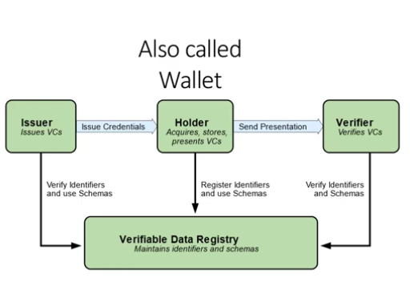
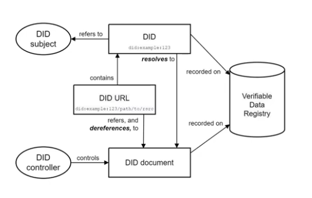
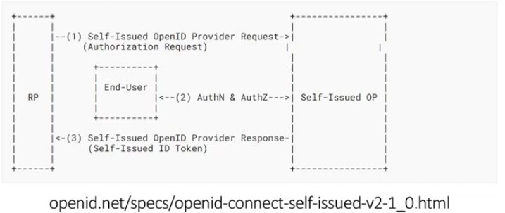

# Microsoft Entra Verified ID  

[AZ-500-SC-100-Understanding and Using Verifiable Credentials - John Savill](https://www.youtube.com/watch?v=BxLSSH_EHjo&t=4834s)   

[Defeat Deep Fakes and Imposters with Verified ID and Face Check - John Savill](https://www.youtube.com/watch?v=58j2PLW-M5k&t=8s)   

[Introduction to Microsoft Entra Verified ID Core Concepts and Use Cases Tech Mind Factory](https://www.youtube.com/watch?v=rek6KDEgGjE&t=913s)   

## Ecosystem Overview

    


### Holder 

A **Holder is a role an entity might perform** by 

- possessing one or more verifiable credentials 
- generating verifiable presentations from them. 

Example holders include students, employees, and customers.
Typically this would be the Wallet App installed on a person's (=the entity) mobile.
A holder is usually, but not always, a subject of the verifiable credentials they hold.
Holders store their credentials in **credential repositories** (i.e the Wallet App).
Holders will **present** the verifiable credential so that they can be verified 
in order to grant them (the subject) some kind of access credentials to some resources.

### Issuer 

**A issuer a role an entity might perform** by: 

- asserting claims about one or more subjects
- creating a verifiable credential from these claims
- transmitting the verifiable credential to a holder. 

Example issuers include corporations, non-profit organizations, trade associations, governments, and individuals.

### Credential Repository

A Credential Repository is a program, such as a storage vault or a **personal verifiable credential wallet**, that 
**stores verifiable credentials and protects access to them**. For example, the **Microsoft Authenticator App** is
one Credential Repository.

### Subject

An entity about which claims are made. Example subjects include human beings, animals, and things. In many cases the holder of a verifiable credential is the subject.


### Verifier

**A Verifiyer is a role an entity performs** by receiving one or more verifiable credentials, 
optionally inside a verifiable presentation, for processing. 
Example verifiers include employers, security personnel, and websites.

Other specifications might refer to the Verifier role as the **Relying Party**.


### Verifiable Data Registry

A **Verifiable Data Registry is a role a system** might perform by **mediating** 
the creation and verification of identifiers, keys, and other relevant data, such as: 

- verifiable credential schemas
- revocation registries
- issuer of public keys
- more

which might be required to use verifiable credentials.

In other words **a Verifiable Data Registry is a role a system is a mediator** among:

- the Holder
- the Issure
- the Verifier

so that the entities with these roles do not have to interact directly with each other in order to 
create, transmit, present use and validate verifiable credentials.

### Verification

Verificatin is the evaluation of whether a verifiable credential or verifiable presentation is an **authentic** 
and a timely statement of the issuer or presenter, respectively. 

This includes checking that: 

- the credential (or presentation) conforms to the specification; 
- the proof method is satisfied; 
- if present, the status check succeeds. 

Verification of a credential **does not imply evaluation of the truth of claims encoded in the credential**, 
it only guarantees that the verifiable credentials are value, not true!

This is why often Verifiable Credentils will be combined with **Identiy Proofing**, that is the **process** 
that verify the identity the identity of the subject of the credential. The typical analogy is that of
a driving license (the verifiable credential) on which some claims about a subject are printed 
(claims on the verifiable credential, the driving licence), in which the officer who issues the driving
luicense document verifies the identity of the subject to whom the verifiable credentials are issued,
often by oher means of verifiable and authentifiable identification, i.e. passports or identity documents 
issues to the subject by other authorities.

### Claim 

A Claim an assertion made about a subject.

### Subject 

The subject is a logical object about which claims are made, i.e. a person, vehicle, employee, etc.

### Credential and Verifiable Credential

**A credential is a set of one or more claims made by an issuer**. 

Credentials can also include **metadata used to describe properities of the credential**, .i.e the issuer or the 
credential creation date and time and expiration date and time, etc.
The **metadata** may also be signed by the issuer to cryptographylly prove that the metadata was issued by the 
issuer.

A **verifiable credential is a tamper-evident credential** that has authorship that can be cryptographically verified. 
Verifiable credentials can be **used to build verifiable presentations**, which can also be cryptographically verified. 
The claims in a credential can be about different subjects.


###  Entity 

Is A thing with distinct and independent existence, such as a person, organization, or device that performs one or more roles in the ecosystem.

---

###  Decentralized Identifier 

A **DID** a **portable URL-based identifier**, also known as a DID, **associated with an entity**. 

These identifiers are most often used in a verifiable credential and are associated with subjects 
such that a verifiable credential itself **can be easily ported from one repository to another without the need to reissue the credential**. 

An example of a DID is string or text value such as `did:example:123456abcdef` whose parts are:

1. The Scheme: did
2. The DID Method: example
3. The DID Method-Specific Identifier: 123456abcdef

---

### Decentralized Identifier Document 

A DID document, is a digital document that is **accessible using a verifiable data registry** 
and **contains information related to a specific decentralized identifier**, such as the 
associated repository and public key information.

A DID document typically:

- **DOES NOT** contain any claims related to the user
- express one or more Verification Methods
- contain cryptographic Public Keys
- add services relevant to the interactions with the DID subject

The `did:example:123456abcdef` **resolves to a DID Document**.
The DID Doc contains information about the DID, for example it contains the DID **controller**.
The values in the DID Doc **are required to very the verifiable credentials**.

> Example 1: a simple DID Document

```
{
"@context": [
    "https://www.w3.org/ns/did/v1",
    "https://w3id.org/security/suites/ed25519-2020/v1"
]
"id": "did:example: 123456789abcdefghi",
"authentication": [{
    // used to authenticate as did:...fghi
    "id": "did:example: 123456789abcdefghi#keys-1",
    "type": "Ed25519VerificationKey2020",
    "controller": "did:example: 123456789abcdefghi",
    "publickeyMultibase": "zH3C2AVvLMv6gmMNam3uVAjZpfkcJCwDwnZn6z3wXmqPV"
}]
}
```

    


> DID controllers 

The controller of a DID is the entity (person, organization,or autonomous software) 
that has the capability (as defined by a DID method) to make changes to a DID document. 
This capability is typically asserted by the control of a set of cryptographic keys used 
by software acting on behalf of the controller, though it might also be asserted via other 
mechanisms.

> DID resolvers and DID resolution 

A DID resolver is a system component that takes a DID as input and produces a conforming DID document as output. 
This process is called DID resolution. The steps for resolving a specific type of DID are defined by the relevant 
DID method specification.

> Verifiable data registries 

DIDs are typically recorded on an underlying system or network of some kind, in order to be resolvable to DID documents. 
Any system that supports recording DIDs and returning data necessary to produce DID documents is called a verifiable data 
registry inrespective of the technology used to implement them. 

Examples include: 

- distributed ledgers
- decentralized file systems
- databases of any kind
- peer-to-peer networks
- other forms of trusted and generally distributed data storage

---

# Interoperability with Current Identity Standards

## 01 OpenID for Verifiable Credentials Issuance

The OpenID for Verifiable Credentials Issuance is the specification that defines the API used to issue verifiable credentials. 

Identity Providers (Issuers) implements this specification to issue verifiable credentials to Holders.

The access to any implementation of the OpenID for Verifiable Credentials is **authorized using OAuth 2.0**.  
This also menas that **any Wallet application will authorize itsself to the any API that issues verifiable creadential with OAuth 2.0**.

---

## 02 OpenID for Verifiable Presentations

> Default Specification

The OpenID for Verifiable Credentials Presentations is the specification that defines the API used to issue Verifiable Presentations. 

**Holders** implement this specification to issue verifiable presentations to Verifiers.

Also this specification mandates that access to the corresponding implementation API is by authorization via OAuth 2.  
Verifiers are the role that requetst access the Verifiable Presentations, therefore this interaxtion is authorizated via OAuth 2.  

> Latest Specification: There is a newer standard for OpenID for Verifiable Presentations

Verifiers are normally Wallet applications, such as one of the many Authenticator Apps that may be installed on a user's mobile.
In the default OpenID for Verifiable Presentations just presented the App obtains an access token through the OAuth 2.0 Authorization Flow.
However, the new standard specifies how an an access token may be obtained by using verifiable credentials already stored in the Wallet. 

> Combination of the New specification for Verifiable Presentations with the Default Specification

The newer specification implementations of the OpenID for Verifiable Presentations can be combined with the **OpenID Connect** default
implementation when it is required that **the ID token is signed by the subject**.

> Combination of the New specification for Verifiable Presentations with other Specifications (for self-issued ID tokens)

...

---

## 03 OpenID for User Authentication: (SIOP v2 [Self-Issued OpenID Porvider])

The OpenID for User Authentication is **distinct from the sepcifications used for the issuance of verifiable credentials and presentetions**
described above.

OpenID Connect defines mechanisms by which an End-User can leverage an **OpenID Provider (OP)** to **release identity information**, 
such as authentication and claims, to a **Relying Party (RP) / Verifier**  which can act on that information. 

In this model, **the RP trusts assertions made by the OP**, i.e. the OP is the issuer of these assertions.

    

---

