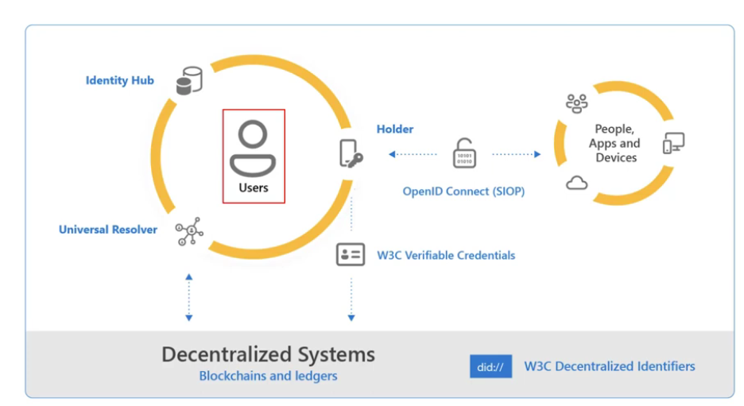
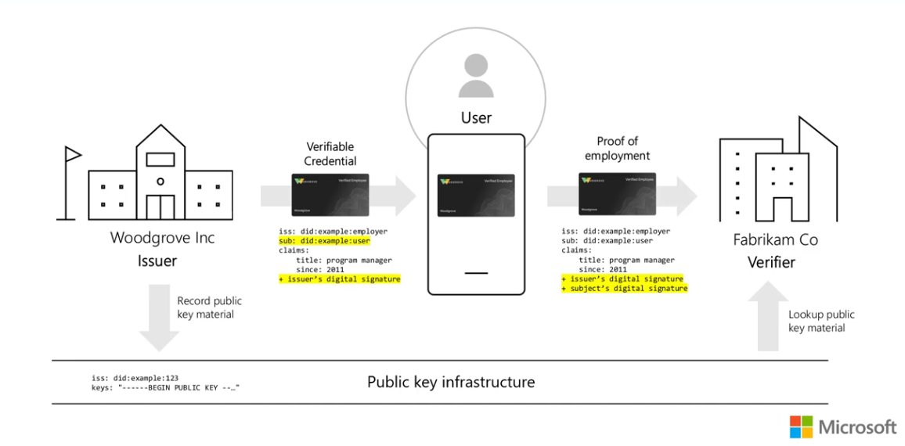

# Microsoft Entra Verified ID  

[AZ-500-SC-100-Understanding and Using Verifiable Credentials - John Savill](https://www.youtube.com/watch?v=BxLSSH_EHjo&t=4834s)   

[Defeat Deep Fakes and Imposters with Verified ID and Face Check - John Savill](https://www.youtube.com/watch?v=58j2PLW-M5k&t=8s)   

[Introduction to Microsoft Entra Verified ID Core Concepts and Use Cases Tech Mind Factory](https://www.youtube.com/watch?v=rek6KDEgGjE&t=913s)   

## Ecosystem Overview

    


### Holder 

A **Holder is a role an entity might perform** by 

- possessing one or more verifiable credentials 
- generating verifiable presentations from them. 

Example holders include students, employees, and customers.
Typically this would be the Wallet App installed on a person's (=the entity) mobile.
A holder is usually, but not always, a subject of the verifiable credentials they hold.
Holders store their credentials in **credential repositories** (i.e the Wallet App).
Holders will **present** the verifiable credential so that they can be verified 
in order to grant them (the subject) some kind of access credentials to some resources.

### Issuer 

**A issuer a role an entity might perform** by: 

- asserting claims about one or more subjects
- creating a verifiable credential from these claims
- transmitting the verifiable credential to a holder. 

Example issuers include corporations, non-profit organizations, trade associations, governments, and individuals.

### Credential Repository

A Credential Repository is a program, such as a storage vault or a **personal verifiable credential wallet**, that 
**stores verifiable credentials and protects access to them**. For example, the **Microsoft Authenticator App** is
one Credential Repository.

### Subject

An entity about which claims are made. Example subjects include human beings, animals, and things. 
In many cases the holder of a verifiable credential is the subject.

### Verifier

**A Verifiyer is a role an entity performs** by receiving one or more verifiable credentials, 
optionally inside a verifiable presentation, for processing. 
Example verifiers include employers, security personnel, and websites.

Other specifications might refer to the Verifier role as the **Relying Party**.


### Verifiable Data Registry

A **Verifiable Data Registry is a role a system** might perform by **mediating** 
the creation and verification of identifiers, keys, and other relevant data, such as: 

- verifiable credential schemas
- revocation registries
- issuer of public keys
- more

which might be required to use verifiable credentials.

In other words **a Verifiable Data Registry is a role a system is a mediator** among:

- the Holder
- the Issure
- the Verifier

so that the entities with these roles do not have to interact directly with each other in order to 
create, transmit, present use and validate verifiable credentials.

### Verification

Verificatin is the evaluation of whether a verifiable credential or verifiable presentation is an **authentic** 
and a timely statement of the issuer or presenter, respectively. 

This includes checking that: 

- the credential (or presentation) conforms to the specification; 
- the proof method is satisfied; 
- if present, the status check succeeds. 

Verification of a credential **does not imply evaluation of the truth of claims encoded in the credential**, 
it only guarantees that the verifiable credentials are value, not true!

This is why often Verifiable Credentils will be combined with **Identiy Proofing**, that is the **process** 
that verify the identity the identity of the subject of the credential. The typical analogy is that of
a driving license (the verifiable credential) on which some claims about a subject are printed 
(claims on the verifiable credential, the driving licence), in which the officer who issues the driving
luicense document verifies the identity of the subject to whom the verifiable credentials are issued,
often by oher means of verifiable and authentifiable identification, i.e. passports or identity documents 
issues to the subject by other authorities.

### Claim 

A Claim an assertion made about a subject.

### Subject 

The subject is a logical object about which claims are made, i.e. a person, vehicle, employee, etc.

### Credential and Verifiable Credential

**A credential is a set of one or more claims made by an issuer about an entity**. 

Credentials can also include **metadata used to describe properities of the credential**, 
.i.e the issuer or the credential creation date and time and expiration date and time, etc.
The **metadata may also be signed by the issuer** to cryptographylly prove that the metadata 
was issued by the issuer.

A **verifiable credential is a tamper-evident credential** that has authorship that can 
be cryptographically verified. Verifiable credentials can be **used to build verifiable presentations**, 
which can also be cryptographically verified. 

The claims in a credential can be about different subjects.

###  Entity 

Is A thing with distinct and independent existence, such as a person, organization, or device that performs one or more roles in the ecosystem.

---

###  Decentralized Identifier 

A **DID** a **portable URL-based identifier**, also known as a DID, **associated with an entity**. 

It is a URI resolvable to DID documents and it is composed of three parts: 

- the scheme did 
- a method identifier
- a unique method-specific identifier specified by the DID method. 

These identifiers are most often used in a verifiable credential and are associated with subjects 
such that a verifiable credential itself **can be easily ported from one repository to another without the need to reissue the credential**. 

An example of a DID is string or text value such as `did:example:123456abcdef` whose parts are:

1. The Scheme: did
2. The DID Method: example
3. The DID Method-Specific Identifier: 123456abcdef

---

### Decentralized Identifier Document 

A DID document, is a digital document that is **accessible using a verifiable data registry** 
and **contains information related to a specific decentralized identifier**, such as the 
associated repository and public key information.

A DID document typically:

- **DOES NOT** contain any claims related to the user
- express one or more Verification Methods
- contain cryptographic Public Keys
- add services relevant to the interactions with the DID subject

The `did:example:123456abcdef` **resolves to a DID Document**.
The DID Doc contains information about the DID, for example it contains the DID **controller**.
The values in the DID Doc **are required to very the verifiable credentials**.

> Example 1: a simple DID Document

```
{
"@context": [
    "https://www.w3.org/ns/did/v1",
    "https://w3id.org/security/suites/ed25519-2020/v1"
]
"id": "did:example: 123456789abcdefghi",
"authentication": [{
    // used to authenticate as did:...fghi
    "id": "did:example: 123456789abcdefghi#keys-1",
    "type": "Ed25519VerificationKey2020",
    "controller": "did:example: 123456789abcdefghi",
    "publickeyMultibase": "zH3C2AVvLMv6gmMNam3uVAjZpfkcJCwDwnZn6z3wXmqPV"
}]
}
```

    


### DID controllers 

The controller of a DID is the entity (person, organization,or autonomous software) 
that has the capability (as defined by a DID method) to make changes to a DID document. 
This capability is typically asserted by the control of a set of cryptographic keys used 
by software acting on behalf of the controller, though it might also be asserted via other 
mechanisms.

### DID subjects 

The subject of a DID is, by definition, the entity identified by the DID. 
The DID subject might also be the DID controller. 
Anything can be the subject of a DID: person, group, organization, thing, or concept.

### DID Methods

DID methods such as `did:web` and `did:ion` are the nechanisms by which 
a particula type of DID and its associated DID Document are: 

- created
- resolved
- updated
- deactivated

### DID resolvers and DID resolution 

A DID resolver is a system component that takes a DID as input and produces a conforming DID document as output. 
This process is called DID resolution. The steps for resolving a specific type of DID are defined by the relevant 
DID method specification.

### Verifiable data registries 

DIDs are typically recorded on an underlying system or network of some kind, in order to be resolvable to DID documents. 
Any system that supports recording DIDs and returning data necessary to produce DID documents is called a verifiable data 
registry inrespective of the technology used to implement them. 

Examples include: 

- distributed ledgers
- decentralized file systems
- databases of any kind
- peer-to-peer networks
- other forms of trusted and generally distributed data storage such as blockchain

---

# Interoperability with Current Identity Standards

OpenID standard is used for the two parts

1. Verifiable Credentials Issuance
2. Verifiable Presentations

## OpenID for Verifiable Credentials Issuance

The OpenID for Verifiable Credentials Issuance is the specification that 
defines the API used to issue verifiable credentials. 

Identity Providers (Issuers) implements this specification to issue verifiable 
credentials to Holders.

The access to any implementation of the OpenID for Verifiable Credentials is 
**authorized using OAuth 2.0**.  This also menas that **any Wallet application** 
**will authorize itself to the any API that issues verifiable creadential with OAuth 2.0**.

**Verifiable Credentials** (VC) are very similar to **identity assertions** such as 
**ID Tokens in OpenID Connect**, in that VC allow a **Credential Issuer** to assert
End-User claims.

---

## OpenID for Verifiable Presentations

> Default Specification

The OpenID for Verifiable Credentials Presentations is the specification 
that defines the API used to issue Verifiable Presentations. 

**Holders** implement this specification to issue verifiable presentations 
to Verifiers. A Verifier implements the issuance of access token to access 
an API based on the verifiable credentials in the verifiable presentation.
The access token amy also be signed by the subject, if required; this makes
it possible to issue self-signed tokens. 

The OpenID for Verifiable Presentations specification mandates that access to the 
implementation API is by authorization via OAuth 2. Therefore, Verifiers are the 
role that requests access to the Verifiable Presentations (through the API), 
therefore this interaction is authorizated via OAuth 2.  

> Latest Specification: There is a newer standard for OpenID for Verifiable Presentations

Verifiers are normally Wallet applications, such as one of the many 
Authenticator Apps that may be installed on a user's mobile.
In the default OpenID for Verifiable Presentations just presented 
the App obtains an access token through the OAuth 2.0 Authorization Flow.
However, the new standard specifies how an an access token may be obtained 
by using verifiable credentials already stored in the Wallet. 

> Combination of the New specification for Verifiable Presentations with the Default Specification

The newer specification implementations of the OpenID for Verifiable Presentations can be combined with the **OpenID Connect** default
implementation when it is required that **the ID token is signed by the subject**.

> Combination of the New specification for Verifiable Presentations with other Specifications (for self-issued ID tokens)

.

---

## 03 OpenID for User Authentication: (SIOP v2 [Self-Issued OpenID Porvider])

    

The OpenID for User Authentication is **distinct from the spEcifications used for the issuance of verifiable credentials and presentetions**
described above. This specification extends OpenID Connect with the concept of a Self-Issued OpenID Provider (Self-Issued OP), 
an **OP controlled by the End-User**. 

It can be combined with OpenID for Verifiable Presentations specification.

OpenID Connect defines mechanisms by which an end-user can leverage an **OpenID Provider (OP)** 
to **release identity information** about the,eselves, such as authentication and claims, to 
a **Relying Party (RP) / Verifier**  which can act on that information. 

In this model, the RP trusts assertions made by the self-issued OP, the self-issued OpenID Provider, 
and eliminates the need for a thrid-party identity provider such as Google or Microsoft. 

The Self-Issued OP does not itself assert identity information about this End-user. 
Instead, the End-user becomes the issuer of identity information. 
Using Self-Issued OPs, the End-Users can authenticate themselves with Self-Issued ID Tokens 
signed with keys under the End-user's control and present self-attested claims directly to the RPs. 
**There is no dependency on centralized Identity Providers**.

The flow from the image can be described as follows:

1. a Relying Party, for example and API implementation that needs to autheticate the user issues an OpenID Provider Request to a Self-Issued OpenID Provider, that is a Identity Provider that implements the Self-Issued OpenID Provider API.

2. The Self-Issued OpenID Provider collect the information about the user that are in the reuest from the RP, whic is enough to identify the user to the Self-Issued OP Provider, and this then carries out Authentication and Authorization against the Wallet of the user. The wallet application of the user, under the control of the user, releases the necessary authorization information about themselves which are also digitally self-signed, and return it ot the OP provider.

3. The OP Provider returns a OP Porvider Response, a self-issued ID Token, to the Relying Party. The RP does not verify the validity of the assertion made on the idetified user, it just trust them as they are digitally self signed and can only have come from the Wallet of the user themselves. The user is in control of any information they wish to share with the RP.

---

## Use Cases

1. If you only need to present and issue Verifiable Credentials AND you do not need ID Tokens 

Use OpenID for Verifiable Credentials Presentation to issue Verifiable Credentials and 
Verifiable Presentations. 

**This standard cannot be used for user authentication**, which means that cannot be used
to produce ID Tokens.

2. When to use (SIOP v2 [Self-Issued OpenID Porvider])

(SIOP) v2 is used to handle user authentication and issue ID Tokens 
to Relying Parties (applications / APIs) usinf the user's Wallet Applications
which are implementation of SIOP-v2 compliant OPs.

3. Combining OpenID for Verifiable Credentials and Presentation with SIOP v2

It is possible to combine the standards described above:

- OpenID for the issuance of Verifiable Credentials and Presentation
- SIOP v2 [Self-Issued OpenID Porvider]

In this case Verifiable Credentials and Verifiable Presentation issuance
is made conditional to the success of a previous user authentication step.
Only when the user is successfully authenticated the Verifiable Credentials 
and Verifiable Presentation are issued.

4. Cryptographically Verifiable Claims

- OpenID for the issueance of Verifiable Credentials and Presentation
- SIOP v2 [Self-Issued OpenID Porvider]

Self-Issued OPs (OpenID Providers) [SIOP v2] can also present cryptographically 
verifiable claims issued by the third parties trusted by the RPs, when used with 
separate specifications such as OpenID for Verifiable Credentials Presentation.

This mechanism allows to enhance the ID Tokens by embedding in them verified claims 
about the subject that can be passed to the consuming application/API (Rely Party).
The advantage of embedding these signed data directly in the ID Token is that the RP 
to which this verified information is presented in the ID Token, **no longer needs** 
**to interact with Claims Issuers** and therefore the RP interacts directly and 
excluively with the user.

In the traditional flow any information concerning the subject of the ID Token is 
obtained by the RP by interacting with the corresponding Identity Provider , tipically 
one of the many well-known Identity Providers, such as Google, Microsoft, etc.

Conversely with SIOP v2 paradigm **decentralization** is possible in that the RP truts 
the enhanced self-igned information included in the ID Tokens issued by a SIOP v2 OP 
which makes the interaction with a centralized identity provider unnecessary and the role
of the **Claims Issuers** **is no longer required**.  

This is arguably the main achievements of the SIOP v2 paradigm.

---

# Decentralized System

     

- the user, and not a Identity Provider, is at the center of this architecture

- data is stored in a decentralized system, which is any system of storage that implements specific protocols for a decentralized storage system, irrespective of the internal implementation details. Examples of technologies that can be use to achieve this goal are: Blockchain, Azure Ledger, etc.

- there is the concept of W3C Decentralized Identifier

- Universal Resolvers are used to retrieve DID Documents

- User can authenticate using Open ID Connect SIOP Compliant Providers

## Example of user workflow

1. The user has a wallet application installed on their mobile phone or device

2. The user 

### Is a wallet application also used to create or obtain verifiable credentials or variable presentations?

Yes, a wallet application (or digital wallet) is a central component in the ecosystem of verifiable credentials (VCs) and, in relation to Verifiable Presentations (VPs), is used to:

- obtain VPs
- store VPs
- create VPs

1. Obtaining Verifiable Credentials (VCs)

The wallet app acts as a secure container to receive and store digital credentials (e.g., mobile driver’s license, diplomas, employee IDs).

- Obtaining: 

The user obtains a credential from an issuer (like a government or university) which is then sent securely to the user's wallet application.

- Secure Storage: 

The wallet acts as a digital repository to store these credentials,   
often protected by biometrics.

2. Creating Verifiable Presentations (VPs)

When a user needs to prove a claim to a verifier (e.g., proving age over 21), the wallet application is used to generate a Verifiable Presentation (VP).

- Creating: 

The wallet signs the presentation with its private key,   
proving the user is the rightful owner of the credentials.

- Selective Disclosure: 

The wallet allows users to pick which credentials to share,  
and sometimes allows them to reveal only specific data within  
a credential (e.g., sharing "over 18" instead of the full birth date).

3. Key Functions of a Wallet

- Issuance: 

Users receive credentials directly into the wallet.

- Management: 

Users can view, organize, and check the status of their credentials.

- Presentation: 

Users present credentials via QR codes or direct links to third parties.

Refs:

[JWT VC Presentation Profile - Draft](https://identity.foundation/jwt-vc-presentation-profile/)  

---

# Microsoft Verified ID

## Core concepts and facts

Microsoft Entra Verified ID uses the OpenID for Verifiable Credentials (Issuance and Presentation) specifications which describes how an issuance or presentation request, and submission should look like when issuers/verifiers communicate with a wallet (Microsoft Authenticator App).

The W3C standards are used by Microsoft Entra Verified ID to define how Verifiable Credentials should look, including which revocation status list spec they follow, etc, so that verifiers from different vendors can understand and verify a presented Verifiable Credentials (for the future interoperability).

The Self-Issued OpenID Provider (SIOP) is used for the id_token_hint attestation flow for Verifiable Credentials claims. We specify `https://self-issued.me` for the issuer instead of an identity provider. In the future it should be possible to authenticate user before the credential is issued.

Azure Active Directory and Azure Active Directory B2C services (at the moment of creating this video) do not support user authentication with Verifiable Credentials. It should be supported in the nearest future so please check the official documentation.

# Microsoft Verified ID example use case

 

1. The user is a employee at Woodgrove Inc
2. Woodgrove Inc is the issuer fo verifiable credential to the subject, the employee
3. The employee uses thier wallet application (Microsoft Authenticator App) to request the Verifiable Credentials from Woodgrove Inc
4. Woodgrove Inc authenticates the employee and based on claims known about the subject issues to them a verifiable credential that is signed with the issuer, Woodgrove Inc, private key
5. The issuer Woodgrove Inc, stores the correspoonding public key on a decentralized infrastructure
6. The verifiable credential is stored in the subject's wallet
7. The employee at Woodgrove Inc wants to access some resources, such as Apps or APIs available at a (partner) business Fabrikam Co
8. The employee releases a Verifiable Presentation with some claims to Fabrikam Co, that is the verifier in this interaction
9.   

---