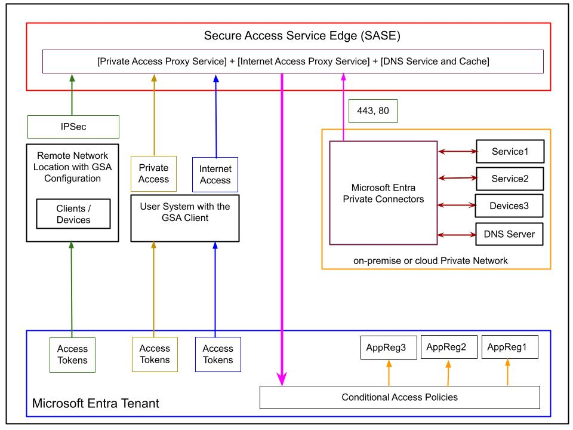

# Global Secure Access with Microsoft Entra

This article expands on the more specific case described by the blog post [Secure Access to Applications with Azure](https://www.neteye-blog.com/2025/09/secure-access-to-applications-with-azure/), 
where the main aim is to secure access to an on-premises application using Microsoft Entra Application Proxy.

[Global Secure Acces](https://learn.microsoft.com/en-us/entra/global-secure-access/) is a unified solution that conisderably 
extends the general concepts discussed in the context of the Microsoft Entra Application Proxy, which covers only the scenario
of private access to (on-premises) web applications.

Global Secure Acces makes it possible and easy to achieve the following goals:

1. Completely remove the need for a VPN and the corresponding setup and maintenance costs.
2. Completely remove the need for a DMZ network to support the VPN infrastructure and the corresponding security risks caused by its implicit and necessary wide access model.
3. Provide a truly identity centric acccess solution with granular control over the digital assets.
4. Allow access control to assets on the Internet or on private networks from anywhere and over any protocol.
 
## Key Terms

- GSA: Global Secure Acces
- GSAC: Global Secure Acces Client Software
- GSE: Global Secure Edge aka SASE: Secure Access Service Edge
- ZTNA: Zero Trust Network Access to control access to private resources
- SWG: Secure Web Gateway to control access to resources available on the public Internet
- CASB: Cloud Access Security Broker to enforce access policies, discover private resources and understand threats
- SDWAN to provide WAN S2S connectivity (NOT IN FOCUS)

# Basic architecture of the Global Secure Access solution

GSA takes advantage of the massive scale of the Microsoft Global WAN which also guarantee its high 
bandwith performance and low latency.

## The GSA Client Software

The **Global Secure Access Client software (GSAC)** is installed on the user's system on various platform; 
it establishes a secure tunnel to the **Global Secure Edge** and all its managed services. 
Installation and management of the GSAC can be implemented with any popular **MDM (Mobile Device Management)**,
while the updates are managed by Microsoft and clearly sibject to the MDM solution for distribution.

**The GSAC software integrates at the OS level** and not at the application software level; therefore,
no application on the user's system can bypass it once it is installed. All the traffic originating from 
and coming to the user's machine will be routed throung the GSAC and between the GSAC software and the 
Global Secure Edge. The **Global Secure Edge (GSE)** and its various services, in turn communicate with 
the **Microsoft Entra Infrastructure**. 

The GSAC software authenticates the user to their Microsoft Entra ID Tenant and interacts with the 
Global Secure Edge (GSE) using this identity. Furthermore any traffic that the GSAC software forwards
to the Global Secure Edge (GSE) is always accompanied by the corresponding access tokens that are 
granted to the user by their Microsoft Entra ID Tenant, therefore the GSE through these access tokes 
is aware of the access policies that must be applied to each individual access and traffic.

Traffic from the GSAC software to the Global Secure Edge (GSE) is actually split into three individual
tunnels, although this details is transparent to the user:

- Traffic to the public Internet including SASS Services
- Traffic to any M365 SaaS Services
- Traffic to any private network for any communication protocol

## The GSA Connector

The GSA Connector is software conceptually equivalent to the Microsoft Entra Application Proxy connector.
It is a Microsoft managed lightweight piece of software that must be istalled on one or more servers
on the private network where the resources that must be securely exposed to legitimate users for access 
are located. The Windows servers on which the GSA Connectors are installed must have line-of-sight to these
resouces and satisfy some minimal requirements. 

The GSA Connector can and should be installed on multiple Windows servers for redundancy and to guarantee
their operation at all times also during any updates. The connectors can and should also be group logically,
but this is a more advanced topic and this article refers the interest reader to the corresponding documentation
for further details.

**GSA connectors only send outbound requests over ports 443 and 80 and must be able to reach the Global Secure Edge (GSE)**, 
therefore they do not need any special opening rule in the existing firewall. No inbound traffic is necessary and no ports 
must be open for inbound traffic, the traffic flows both ways after a session is established with the GS. 

**GSA Connectors are stateless**, and the number of users or sessions does not affect them and the memory consumption is low. 
They respond to the number of requests and the payload size. With standard web traffic, an average machine can handle 
2,000 requests per second. 

The CPU and the network capacity have a much larger impact on the connector performance. The CPU is used for TLS encryption 
and decryption, whereas networking is important to get fast connectivity to the applications and the online service.

---

# Microsoft Entra ID Access Policy and Global Secure Access

The defining property of the Global Secure Access solution is its thight integration with the Microsoft Entra ID Access Policy feature.

There are essentially three distinct types of traffic that can be overseen by the Global Secure Access solution.

- Private traffic: any traffic that must reach a private network either on-premise or in any of cloud infrastructure.
- Internet traffic: any traffic that must reach resources available on the public Internet including SaaS services by any provider.
- Microsoft 365 traffic: any traffic to SaaS services specific to the Microsoft 365 ecosystem.

The Access Policy resource in Microsoft Entra ID has been updated so that, during its definition, the available options 
for the target traffic of the access policy include the Global Secure Access option. By selecting the Global Secure Access 
option as the target of an access policy, the options available for selection at the step of the traffic profiles to which 
the policy will be applied are expanded to the corresponding:

- Private traffic
- Internet traffic
- Microsoft 365 traffic

The GSA Client establishes dedicated channels to the Microsoft Entra Security Edge for each of these three types, 
and the SSE will apply to each traffic the corresponding set of controls and policies.

---

# Tenant Restrictions and Named Location

Named Locations is a tenant-level Microsoft Entra ID feature in which locations can be defined in different ways, 
such as ranges of IP addresses or entire geographical regions, and then used in the definition of access policies 
to apply traffic controls to allow, disallow, or require further actions such as the typical MFA interaction.

Administrators of a Micrsoft Entra Tenant ca use this meachanism to control which origins and targets are allowed 
for any traffic to the resources controlled by the tenant. One of the drawbacks of controlling the allowed origin 
of any traffic through Named Locations is the administrative cost of setting up and maintaning the list of named 
locations, but ingeneral this instrument is more limited in its capabilities when compared to 

- Compliant network checks
- Tenant Restrictions
- Universal Tenant Restrictions with Global Secure Access

## [Compliant network checks in Global Secure Access](https://learn.microsoft.com/en-us/entra/global-secure-access/how-to-compliant-network)   

This feature is entirely based on the integration og the Global Secure Access and the Conditional Acess 
and prevents malicious access from managed devices to: 

- Microsoft apps 
- third-party SaaS apps 
- private line-of-business (LoB) apps 

This is achived by specifying Conditional Acess Policies using multiple conditions 
in any combination of required factors:

- strong factor authentication, i.e. required MFA  
- device compliance
- location
- other factors.. 

This compliant network feature makes it easier for administrators to manage access policies:

1. without having to maintain a list of egress IP addresses
2. removing the requirement to hairpin traffic through organization's VPN in order to maintain source IP anchoring and apply IP-based Conditional Access policies

For example, if you define a Conditional Access policy requiring compliant network in `contoso.com`, 
only users with the Global Secure Access or with the configuration from a compliant Remote Network 
are capable of passing this control. A user from `fabrikam.com` will not be able to pass contoso.com's 
compliant network policy from the managed device or from within any device in a non compliant Remote 
Network.

The compliant network is different than IPv4, IPv6, or geographic locations you might configure in Microsoft Entra. Administrators are not required to review and maintain compliant network IP addresses/ranges, strengthening the security posture and minimizing the administrative overhead.

---

## [Tenant Restrictions and Universal Tenant Restrictions](https://learn.microsoft.com/en-us/entra/external-id/tenant-restrictions-v2#step-3-enable-tenant-restrictions-on-windows-managed-devices)  

Tenant restrictions offer a better way to achieve the same goal, and more. 

These restriction are defined on the tenant and for any managed devices and corresponding tenant users.

The Universal Tenant Restrictions are an inprovement over the plain tenant restriction per tenant and user
that can be applied to the managed device through the GSA Client which works at the operating system level 
making  them impossible to circumvent by any user of the managed device.

There are two types of Tenant Restrictions:

1. Authentication plane protection 

This type fo tenant restrictions block sign-ins that use external identities. 

For example, they prevent a malicious insider from leaking data over external email by 
didallowing signing in to their malicious tenant from the manage device. 

2. Data plane protection 

This prevents attacks that bypass authentication. 

For example, an attacker might try to allow access to a malicious tenant's apps by anonymously 
joining a Teams meeting or anonymously accessing SharePoint files. Or the attacker might copy 
an access token from a device in a malicious tenant and import it to your organizational device. 
Data plane protection in tenant restrictions forces the user to authenticate for attempts to 
access a resource. Data plane protection blocks access if authentication fails.

The Authentication plane protection feature of Tenant restriction is expanded by its integration
with Globals Secure Access as [Universal Tenant Restrictions](https://learn.microsoft.com/en-us/entra/global-secure-access/how-to-universal-tenant-restrictions)

The Global Secure Access tags all traffic no matter the operating system, browser, or device form factor
including any remote network connectivity (explained later). Global Secure Access adds policy information 
for tenant restrictions to the authentication plane's network traffic that reaches the SSE.

As a result, users who use managed devices and networks in your organization must use only authorized 
external tenants; therefore this feature prevents data exfiltration for any application integrated with 
your Microsoft Entra ID tenant through single sign-on (SSO).

The fllowing scenarios will be prevented by the Universal Tenant Restrictions:

- user with a managed device tries to access a Microsoft Entra-integrated app with an unsanctioned external identity
- Authentication Level Protection: the user tries to replay any Authentication tokens copied over from other devices to the client with the Global Secure Access client or via remote networks.
- Data Plane Protection: the user tries to replay any  Access tokens copied over from other devices to the client with the Global Secure Access client or via remote networks.

---

# Global Secure Access: Private, Internet and Microsoft 365 Access

As discussed in the preceeding section GSA unified the governance of the access to resources
from managed devices through the unified intergation of the following tools: 

- The GSA Clinet that is installed on any managed device
- The Access Policies that can be defined on the tenant of the managed device
- A unified GSA Connector that, only in the case of access to private resources, must be installed on the target private netwok.

It has also been said GSA manages the following types of traffic and access:

- Private traffic
- Internet traffic
- Microsoft 365 traffic

---

# Private Access through GSA

In this section the focus is on the case in which a managed device must be able to access resources
maintaned on a private network under the following conditions:

1. without having to setup or maintain a VPN, DMZ or a managed reverse proxy.
2. acces must be granted only to compliant devices and users from anywhere and/or compliant networks based on identity-centric policies and conditions.
3. acess governance myst be possible over any type of networjk traffic and not only HTT(S), therefore covering also UDP/TCP and more.

Private Access is that it is designed to work hand in hand with the Microsoft Entra Application Registrations (Apps), 
which in this context will be referred to as Private Access Applications. The overarching goal of Private Access is 
to allow organizations to replace their classic broad-access VPN with a completely identity-centric, zero-trust 
selective segmented access without overlaps.

There are two types of Private Access Applications:

1. Microsoft Entra Application Registrations for Private Access:

Eeach App Regoistration represents a granular access segment, 
for example RDP to a specific VM on the private nework.

The attributes of each App Registration specification are:

- IP, IP ranges or CIDR
- Fully Qualified Domain Name (FQDN)
- Port ranges

The definition of these App Registration must be non-overlapping, therefore each must control 
the access through a specific combination of these attributes.

2. Quick Access Application: 

It is possible to have single broad traffic accces segment that spares the dministrative cost 
of having to define an Microsoft Entra Application Registrations with a distinct combination
of attributes for each sinlge resource individually, when it is acceeptable to consolidate some
access to network resources through teh same App Registration unit.

Private Access covers any traffic built on top of the network protocols UDP and TCP and analyzes 
the traffic as `LAYER-4 (Transport Layer)` rather than `LAYER-7 (Application Layer)`; therefore, 
it is not a substitute for Azure Application Proxy, as some of the capabilities that are available 
as part of the agent that powers Azure Application Proxy use the application layer. A notable example 
is the Single-Sign-On (SSO), which is a feature of the Azure Application Proxy but not of the Private Access.

However, a replacement for the the Azure Application Proxy within GSA is discussed later in the 
section dedicated to **the GSA Internet Access**.

The following is a list of protocols that are covered by the GSA Private Access:

- RDP
- SSH
- FTP
- TCP
- UDP
- SMB
- Printer procols
- others..

### [GSA Private Access Domain Resolution Mechanism](https://learn.microsoft.com/en-us/entra/global-secure-access/concept-private-name-resolution)  

An important aspect of Private Access is how domain name resolution (DNS) is accomplished; this is important 
because it allows a GSAC to resolve private domains whose records are on a private domain server owned by the 
organization and possibly internal to the corporate network, without having a reference to this private DNS 
service or even being actually tunneled to the corporate network at all.

It is in fact natural to expect that a user on a manged device on the public Internet, for example a remote
employee with a managed device with the GSA Client working from home, should be able to resolve domain names
maintained by the employer's DNS Server, that is a private DNS Server. 

The foundamental problem in this case is that GSA is a not a VPN and therefore there is no possibility 
to use the private employer's DNS Server as DNS Server of the user's managed device; there is no direct 
network line of sight between the managed device and the firm's private network.

This problem is solved transparently to the user by the GSA Private Access technology through: 

- The DNS Service and Cache component of the Secure Access Service Edge
- The GSA Connector that is installed on-premise
- The set of Microsoft Entra ID App Registration that are used to controll the on-premise acccess through GSA as explained above

The way these three elements cooperate to make possible the DNS Resolution of private records from the managed device
is not technically straightforward, therefore a simplified explanation will be presented here, referring the readers 
intrested in the thourough technical details to the documentation.

- for each App Regitration a local DNS Suffix `<appid>.globalsecureaccess.local` is configured in the GSA Client
- when the user on the managed device tries to resolve a name from teh machine the GSA client will append the `<appid>.globalsecureaccess.local` to it.
- when the `label-name.<appid>.globalsecureaccess.local` is received by the SASE DNS Service
- if the DNS Service has a cached resolution for that entry it respnds to the DNS lookup of the client
- if the DNS Service does not have a cached resolution for that entry it strips the `<appid>.globalsecureaccess.local` part and stage it for the on-premise GSA connector to be picked up by its relay mechanism
- when the on-premise connector finds the DNS related item it tries to resolve the name against the on-premise DNS server with which it is configured
- if a record is fond then the response travels back to the SSA DNS Service, it is cached and sent over to the GSA client on the managed device

---

# Internet Access through GSA

This works for all the traffic at LAYER-7 (Application Layer); therefore, HTTP(S) and the controls are based on Web Filtering Policies (WFP) that are defined in Microsoft Entra ID.

Web filtering policies are essentially named groupings of web categories or FQDNs for which a certain action is specified.

For example, a WFP can be created with the following details:

Name: Social
Categories: Social Platforms
FQDN: https://www.facebook.com/
Action: Allow
Name: WorkOnly
Categories: Any
FQDN: https://www.**microsoft**.com/, https://www.**mycorporate**.**/,
Action: Allow
Name: Ban Social, Entertainment and Gambling
Categories: Gambling, Entertainment, Social
FQDN: https://www.**microsoft**.com/, https://www.**mycorporate**.**/, **gambling**,...
Action: Block

Internet Access Security Profiles (IASP) are collections of web filtering policies that will be applied to sets of groups of users within a tenant. Each IASP specifies its own unique value of priority between 0 and 65000, and each arranges its set of WFP by specifying for each a number that indicates its relative priority with respect to the other WFP within the same WFP.

IASP Name: Marketing Work
Priority: 500
WFP-Priority-100: Social
WFP-Priority-200: Work
WFP-Priority-300: Ban Social, Entertainment and Gambling
IASP Name: General Work
Priority: 600
WFP-Priority-200: Work
WFP-Priority-300: Ban Social, Entertainment and Gambling

This scheme guarantees that the Internet traffic originating from different groups of users can be treated by the WFP without conflicts. For example, the tenant administrators might want to forbid all gambling activities for all users, and while for some users also the social sites should be barred, for some other users, such as for the marketing team, they should not be barred.

The smaller the priority value, the sooner the IASP is applied to the traffic; therefore, blocking actions with the small priority values will filter out the corresponding traffic. This also means that the IASP with allowed actions will generally have smaller priorities than the corresponding block actions; for example, when the tenant wants to block access to social media for all user groups except the marketing team.

The last missing piece of this mechanism is the link between the IASP and the user groups. This is important because it is implemented through the well-established construct of Conditional Access Policy. The tenant administrator can now create CAPs such as the following, with the only restrictions being that each of these CAPs can only be assigned one Internet Access Security Profile (IASP) and that their action must be set to allow:

CAP Name: Internet Marketing
Group: Marketing
Type: GSA-Internet
Internet Access Security Profile (IASP): Marketing Work
Action: Allow
CAP Name: Internet All Employees
Group: Employee
Type: GSA-Internet
Internet Access Security Profile (IASP): General Work
Action: Allow
The restriction that the Internet Access Security Profile (IASP) and that their action must be set to allow may appear counterintuitive and somehow redundant, as the WFPs on the IASPs already express their own action as Action: Block or Action: Allow.

The action specified at the Conditional Access Policy level for the GSA-Internet traffic is a switch that either blocks completely the traffic for that group of users when set to Block or allows the traffic to be forwarded from the GSA client to the set of web filtering policies specified for the corresponding Internet Access Security Profile (IASP). This means that if set to block all the Internet traffic for the users with the GSA client that are part of the Entra group, i.e., marketing, it will be blocked, and therefore they will not be able to reach any resource on the Internet at all.
The action specified at the web filtering policy instead is applied when the traffic routed from the GSA client for the specified group of Entra users through the Entra Secure Edge matches the definitions in the Category or FQDN specifiers.
The attentive reader at this point might wonder how this Global Secure Internet Access feature of Microsoft Entra can possibly be identity-centric and adhere to the tenets of Zero Trust. On the surface it might seem that this feature might actually work at the network level whereby the traffic is routed through the GSA over to the Microsoft Entra Security Edge, and then it is inspected to decide which traffic must be filtered out and therefore prevented from reaching out to its destination on the Internet.

This model is almost right but misses one very important detail: How can the Microsoft Entra Security Edge determine which set of web filtering policies should be applied to the traffic that it receives from a specific GSA client?

User log in to their managed devices with their Microsoft Entra ID identity, which is also the identity used by the GSA Client installed on the device. During the authentication of the GSA Client on the corresponding tenant the authentication token that are assigned to the GSA Client will be used to acquire access tokens, which also have an expiration time of about 1 hour, with the expanded claims for the Microsoft Entra Security Edge. These access tokens hold the information that Microsoft Entra needs to deteremine which web filtering policies should be applied to the traffic that it receives from a specific GSA client.

The result of this mechanism is the oveall solution satisfy the requirement of being identity-centric and also the Zero Trust tenet of continual verification.

Cost Aspects of the GSA
Licensing overview

Microsoft Entra Internet Access for Microsoft services capabilities are included in the following per-user licenses:

Microsoft Entra ID P1
Microsoft Entra ID P2
Microsoft Entra Suite license

References

Microsoft Entra Global Secure Access
Microsoft Entra Private Access
Microsoft Entra Internet Access for all apps

Global Secure Access Remote Network Connectivity
Common remote network connectivity scenarios

Microsoft Entra private network connectors

Microsoft Entra Security Service Edge Overview - John Savill - YouTube
Deep Dive on Microsoft Entra Private Access - John Savill - YouTube
Deep Dive on Microsoft Entra Internet Access - John Savill - YouTube
