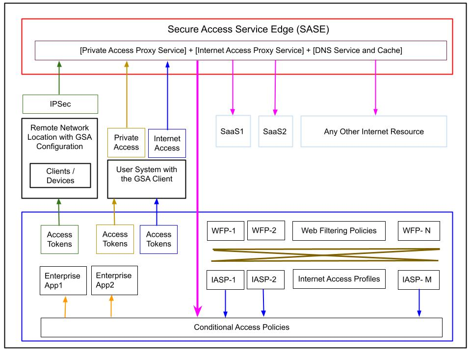

# Global Secure Access with Microsoft Entra

This article expands on the topic introduced in the earlier blog post [Secure Access to Applications with Azure](https://www.neteye-blog.com/2025/09/secure-access-to-applications-with-azure/), which focused on securing access to an on-premises web application with Microsoft Entra Application Proxy.

[Global Secure Access](https://learn.microsoft.com/en-us/entra/global-secure-access/) is Microsoft's unified framework for securing access to private resources, Microsoft 365 services, and internet destinations through identity-aware controls. It brings Microsoft Entra Private Access and Microsoft Entra Internet Access together in a single administrative and policy model.

Global Secure Access makes it possible to achieve the following goals:

1. Replace many traditional VPN scenarios with identity-aware access to private resources.
2. Reduce the need to expose broad network access to remote users.
3. Apply granular, identity-centric access control to private and internet resources.
4. Extend policy enforcement beyond private applications to Microsoft 365 and internet traffic.

## Key terms

- **GSA**: Global Secure Access
- **Global Secure Access Client**: the endpoint client used to forward supported traffic through the service
- **SSE**: Security Service Edge
- **ZTNA**: Zero Trust Network Access
- **SWG**: Secure Web Gateway
- **CASB**: Cloud Access Security Broker

# Basic architecture of the Global Secure Access solution

Global Secure Access uses Microsoft's global network presence to connect users to private resources, Microsoft 365, and internet destinations through a unified service plane.

## The Global Secure Access Client

The **Global Secure Access Client** is installed on managed endpoints and is responsible for forwarding supported traffic to the Global Secure Access service. It works at operating system level and is typically deployed and managed through endpoint management tools such as Microsoft Intune or another MDM solution.

The client forwards traffic according to the enabled **traffic forwarding profiles** and the applicable policy configuration. This point is important: traffic handling depends on what profiles are enabled and what scenarios are supported, not simply on the presence of the client alone.

At a high level, the client can participate in forwarding three traffic categories:

- **Private traffic**
- **Microsoft 365 traffic**
- **Internet traffic**

These traffic categories are then processed by the service according to Microsoft Entra policy, user context, device context, and the specific capabilities enabled in the tenant.

## The private network connector

The **Microsoft Entra private network connector** is used for Microsoft Entra Private Access. It is a lightweight Microsoft-managed component installed on Windows Server systems that have line of sight to the private resources being published through the service.

Like the Microsoft Entra Application Proxy connector, it uses an outbound-only communication model. No inbound firewall opening is required for the connector itself, because the connector initiates the connection to the Microsoft service.

Connectors should be deployed redundantly on multiple Windows Servers. They are stateless, and Microsoft recommends using more than one connector for resilience and scale.

Connector performance depends more on request rate, payload size, CPU, and network capacity than on raw user or session count. Microsoft states that, with standard web traffic, an average machine can handle around 2,000 requests per second.

---

# Conditional Access and Global Secure Access

A key property of Global Secure Access is its integration with **Microsoft Entra Conditional Access**.

Global Secure Access supports policy-driven handling of three traffic categories:

- **Private traffic**: traffic to private applications and resources
- **Internet traffic**: traffic to internet and SaaS destinations
- **Microsoft traffic**: traffic to supported Microsoft 365 services

This model allows organizations to apply identity-aware controls to network access, not only to cloud application sign-in events. Microsoft refers to this as **Universal Conditional Access** through Global Secure Access.

In practice, Conditional Access can be used with Global Secure Access to require conditions such as:

- multifactor authentication
- compliant device
- acceptable sign-in risk
- compliant network, where supported

---

# Tenant restrictions, compliant network, and named locations

Traditional **Named Locations** in Microsoft Entra are based on IP ranges or geographies and are still useful in some scenarios. However, they have operational limits because they require administrators to maintain trusted source ranges manually.

Global Secure Access improves this area with features such as:

- **Compliant network**
- **Universal Tenant Restrictions**

These features reduce dependency on static IP-based trust models and improve policy consistency across managed endpoints and supported network paths.

## Compliant network

[Compliant network check in Global Secure Access](https://learn.microsoft.com/en-us/entra/global-secure-access/how-to-compliant-network) allows administrators to require that access comes through the Global Secure Access service path for the correct tenant.

This helps in two main ways:

1. it reduces the need to maintain trusted egress IP ranges
2. it removes the need to hairpin traffic through VPN infrastructure only to preserve IP-based trust for Conditional Access

For example, if a tenant requires compliant network, only devices using the Global Secure Access client or users behind a configured remote network can satisfy that control for supported scenarios.

**Important limitation:** compliant network check is currently **not supported for Private Access applications**.

## Tenant Restrictions and Universal Tenant Restrictions

[Tenant Restrictions v2](https://learn.microsoft.com/en-us/entra/external-id/tenant-restrictions-v2#step-3-enable-tenant-restrictions-on-windows-managed-devices) help control how managed users and devices interact with external Microsoft Entra tenants.

Universal Tenant Restrictions extend this model by using Global Secure Access to tag traffic consistently across supported clients and remote network connectivity.

This improves enforcement in two areas:

1. **Authentication plane protection**  
   This helps block sign-in attempts that use unauthorized external identities.

2. **Data plane protection**  
   This helps reduce token replay and unauthorized resource access in supported Microsoft-integrated scenarios.

A practical benefit is that organizations can reduce the risk of data exfiltration to unauthorized external tenants or personal accounts while keeping policy management centralized.

---

# Global Secure Access: Private, Internet, and Microsoft traffic

Global Secure Access provides a unified model for managing access from managed devices through:

- the **Global Secure Access Client**
- **Conditional Access**
- **traffic forwarding profiles**
- **security policies**
- **private network connectors**, where Private Access is involved

At a high level, Global Secure Access supports:

- **Private Access**
- **Internet Access**
- **Microsoft traffic access**

Each of these areas solves a different problem and should be treated as a distinct capability in architecture design.

---

# Private Access through GSA

This section focuses on the scenario where a managed device needs secure access to private resources without relying on traditional broad-access remote connectivity.

The main design goals are:

1. avoid classic VPN-style broad network access
2. allow access based on user identity and device state
3. support non-HTTP protocols as well as web traffic
4. apply segmented access to specific private destinations

Microsoft Entra Private Access is Microsoft's ZTNA capability for private resources.

## Private Access application model

Private Access works with **enterprise applications** that act as containers for the private resources that must be published through the service. Microsoft documentation describes two main models:

1. **Quick Access**
2. **Global Secure Access applications**

These applications define private access segments using combinations of:

- IP addresses or IP ranges
- FQDNs
- protocols
- ports

This allows organizations to move from broad VPN access toward more selective per-app or per-segment access.

## Relationship to Application Proxy

Private Access is not the same thing as **Microsoft Entra Application Proxy**.

The difference is important:

- **Application Proxy** is focused on publishing web applications and can provide application-layer capabilities such as integrated web SSO scenarios.
- **Private Access** is designed for private resource access more generally and can cover TCP- and UDP-based scenarios beyond HTTP and HTTPS.

Because of this, Private Access is **not** a universal replacement for every Application Proxy scenario, and Internet Access is **not** a replacement for Application Proxy either.【call_qqiVeij6mF4lmXIi1RzyE0lb-1】【call_qqiVeij6mF4lmXIi1RzyE0lb-2】

## Protocol coverage

Private Access is designed for private traffic beyond standard web publishing scenarios. Typical examples include:

- RDP
- SSH
- SMB
- custom TCP applications
- custom UDP applications

This is one of the main reasons why it is useful as a modern replacement for many VPN-based access patterns.

## Private name resolution

An important aspect of Private Access is **private name resolution**.

Remote users often need to resolve internal names even when they are not directly connected to the corporate network in the traditional VPN sense. Microsoft Entra Private Access addresses this through a service-assisted model in which the client, the service, the connector, and the configured private DNS settings work together to resolve private names securely.【call_qqiVeij6mF4lmXIi1RzyE0lb-7】

The most important architectural point is this:

- the endpoint does not need classic full-network VPN connectivity to resolve private application names
- Private Access can use the configured private network and DNS integration to support name resolution for published private resources

This topic has important implementation details, so the Microsoft documentation should be treated as the authoritative reference for final deployment design.

---

# Internet Access through GSA

Microsoft Entra Internet Access is the **identity-aware Secure Web Gateway** part of Global Secure Access. It is used to control user access to internet and SaaS destinations through centrally managed policies.【call_qqiVeij6mF4lmXIi1RzyE0lb-1】

## Web filtering policies

Web filtering policies define rules for internet access. These rules can be based on:

- web categories
- FQDNs【call_GSyrj7jUAJiktG9K4OdUI2le-0】

Examples include:
- allowing access to selected business sites
- blocking gambling or entertainment categories
- allowing broader web access for specific business units, such as marketing

## Security profiles

Internet security policies are grouped into **security profiles**. These profiles allow administrators to apply a policy set to selected traffic in a structured and scalable way. Baseline and custom profiles are both relevant depending on the design scenario.【call_GSyrj7jUAJiktG9K4OdUI2le-5】【call_GSyrj7jUAJiktG9K4OdUI2le-9】

## Identity-centric policy enforcement

A central architectural property of Internet Access is that policy is not only network-based. It is tied to the identity and device context available through Microsoft Entra.

This means the service can apply different internet access controls based on:
- user group
- device state
- Conditional Access conditions
- assigned security profile【call_GSyrj7jUAJiktG9K4OdUI2le-5】【call_GSyrj7jUAJiktG9K4OdUI2le-6】

This is what makes the solution align with Zero Trust principles rather than acting as a traditional location-based web proxy.

---

# Remote network locations with Global Secure Access

[Remote network connectivity](https://learn.microsoft.com/en-us/entra/global-secure-access/concept-remote-network-connectivity) is intended for locations such as branch offices, where traffic from a network site can be routed into Global Secure Access without installing the client on every endpoint.

This is useful when the traffic source is a managed site rather than an individual roaming device.

However, the scope of remote networks must be described carefully.

## Important limitation

At the time of writing:

- **Private Access traffic can only be acquired with the Global Secure Access client**
- **remote networks cannot be assigned to the Private Access traffic forwarding profile**【call_GSyrj7jUAJiktG9K4OdUI2le-3】

So remote network connectivity should not be described as a replacement for the client in Private Access scenarios.

Remote networks are more relevant for:
- Microsoft traffic scenarios
- internet traffic scenarios
- tenant-wide security policy application in supported cases【call_GSyrj7jUAJiktG9K4OdUI2le-0】【call_GSyrj7jUAJiktG9K4OdUI2le-5】

---

# Licensing and cost considerations

Licensing for Global Secure Access should be verified carefully before implementation.

Microsoft states that users need **Microsoft Entra ID P1 or P2** to use Microsoft Entra Private Access and Microsoft Entra Internet Access in general.【call_qqiVeij6mF4lmXIi1RzyE0lb-1】

Feature-specific licensing may still vary. For example:
- remote network connectivity has its own conditions
- some capabilities depend on additional licensing or feature availability【call_GSyrj7jUAJiktG9K4OdUI2le-0】【call_GSyrj7jUAJiktG9K4OdUI2le-4】

The practical recommendation is simple:

- verify licensing early in the design phase
- verify current feature availability before committing to the architecture
- avoid assuming that one license statement covers all GSA capabilities

---

# Current limitations and design caveats

Before adopting Global Secure Access in production, it is useful to keep a few current limitations in mind:

- Private Access is not a drop-in replacement for every Application Proxy scenario
- compliant network check is currently not supported for Private Access applications【call_GSyrj7jUAJiktG9K4OdUI2le-3】
- remote networks cannot currently acquire Private Access traffic【call_GSyrj7jUAJiktG9K4OdUI2le-3】
- feature behavior and licensing should always be validated against current Microsoft documentation【call_qqiVeij6mF4lmXIi1RzyE0lb-1】

---

# Conclusion

Global Secure Access is an important step in Microsoft's broader Zero Trust strategy. It brings together private access, internet access, and Microsoft traffic control under a single identity-aware service model.【call_qqiVeij6mF4lmXIi1RzyE0lb-1】

For architects, the main value is not only feature consolidation, but the shift from broad network trust to policy-driven, segmented, identity-centric access.

Microsoft Entra Private Access is especially relevant where organizations want to reduce dependency on traditional VPN patterns for private resource access. Microsoft Entra Internet Access extends the same architectural direction to internet and SaaS traffic through identity-aware Secure Web Gateway controls.【call_qqiVeij6mF4lmXIi1RzyE0lb-1】【call_qqiVeij6mF4lmXIi1RzyE0lb-2】

The most important design principle is to understand the boundaries of each capability clearly:
- Private Access for private resources
- Internet Access for internet and SaaS traffic
- Universal controls such as tenant restrictions and compliant network where supported

Used correctly, Global Secure Access can simplify access architecture, improve security posture, and reduce reliance on legacy connectivity models.

# References

[Secure Access to Applications with Azure - NetEye Blog](https://www.neteye-blog.com/2025/09/secure-access-to-applications-with-azure/)【call_RiSlc313dKYXHA1mVdSkvElE-0】

[Microsoft Entra Global Secure Access](https://learn.microsoft.com/en-us/entra/global-secure-access/)【call_qqiVeij6mF4lmXIi1RzyE0lb-0】  
[What is Global Secure Access?](https://learn.microsoft.com/en-us/entra/global-secure-access/overview-what-is-global-secure-access)【call_qqiVeij6mF4lmXIi1RzyE0lb-1】  
[Microsoft Entra Private Access](https://learn.microsoft.com/en-us/entra/global-secure-access/concept-private-access)【call_qqiVeij6mF4lmXIi1RzyE0lb-2】  
[Global Secure Access admin center quickstart](https://learn.microsoft.com/en-us/entra/global-secure-access/quickstart-access-admin-center)【call_qqiVeij6mF4lmXIi1RzyE0lb-4】  
[Microsoft Entra private network connectors](https://learn.microsoft.com/en-us/entra/global-secure-access/concept-connectors)【call_rDTvDpF3n8ZdGwVN6DT0Qp9S-0】  
[How to configure connectors for Microsoft Entra Private Access](https://learn.microsoft.com/en-us/entra/global-secure-access/how-to-configure-connectors)【call_rDTvDpF3n8ZdGwVN6DT0Qp9S-2】  
[Global Secure Access and Universal Tenant Restrictions](https://learn.microsoft.com/en-us/entra/global-secure-access/how-to-universal-tenant-restrictions)【call_GSyrj7jUAJiktG9K4OdUI2le-1】  
[Enable Compliant Network Check with Conditional Access](https://learn.microsoft.com/en-us/entra/global-secure-access/how-to-compliant-network)【call_GSyrj7jUAJiktG9K4OdUI2le-2】  
[Known Limitations for Global Secure Access](https://learn.microsoft.com/en-us/entra/global-secure-access/reference-current-known-limitations)【call_GSyrj7jUAJiktG9K4OdUI2le-3】  
[Learn about Universal Conditional Access Through Global Secure Access](https://learn.microsoft.com/en-us/entra/global-secure-access/concept-universal-conditional-access)【call_GSyrj7jUAJiktG9K4OdUI2le-6】  
[Security guidance - Protect networks](https://learn.microsoft.com/en-us/entra/fundamentals/zero-trust-protect-networks)【call_GSyrj7jUAJiktG9K4OdUI2le-9】  
[Microsoft Entra Security Service Edge Overview - John Savill - YouTube](https://www.youtube.com/watch?v=4RVkbKjeU10)【call_Vclc7m6qFSa2ZZybOa7vJFME-0】  
[Deep Dive on Microsoft Entra Private Access - John Savill - YouTube](https://www.youtube.com/live/RsxxsEzQhrM)【call_Vclc7m6qFSa2ZZybOa7vJFME-6】  
[Deep Dive on Microsoft Entra Internet Access - John Savill - YouTube](https://www.youtube.com/watch?v=844s2bpA1aU)【call_Vclc7m6qFSa2ZZybOa7vJFME-1】
